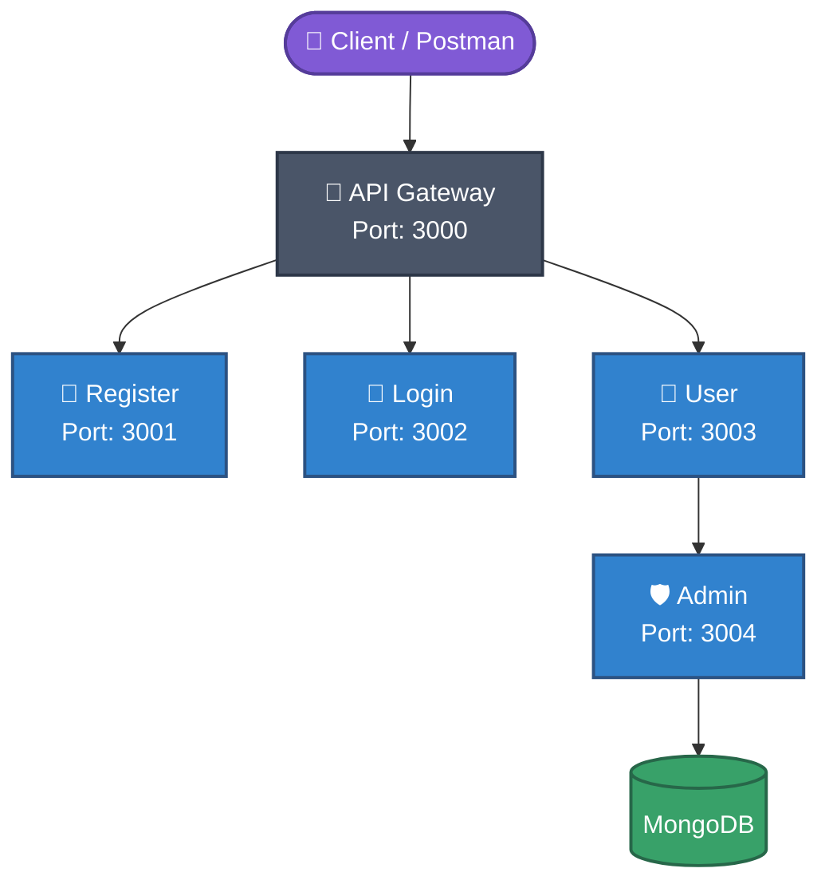

# 🔐 Role-Based User Management System

A **Central Identity and User Management Platform** built using independent microservices, API Gateway, JWT authentication, and MongoDB.

---

## 📌 Project Overview

This project provides a secure user management platform with two different roles:

- 👤 **User**
- 🛡️ **Admin**

The system uses an **API Gateway** to control communication between the client and the independent microservices.

---

## 🏗️ Architecture



---

## ⚙️ Services

| Service      | Port  | Responsibility                          |
|--------------|-------|------------------------------------------|
| API Gateway  | 3000  | JWT validation, role validation, routing |
| Register     | 3001  | New user registration                    |
| Login        | 3002  | Authentication & JWT issuance            |
| User         | 3003  | User profile & data operations           |
| Admin        | 3004  | Admin-level operations                   |

---

## 🗄️ Database

All persistent data is stored in **MongoDB**.

---

## 🚀 Getting Started

```bash
# Clone the repository
git clone <your-repo-url>

# Install dependencies for each service
cd api-gateway && npm install
cd ../register-service && npm install
cd ../login-service && npm install
cd ../user-service && npm install
cd ../admin-service && npm install
```

---
